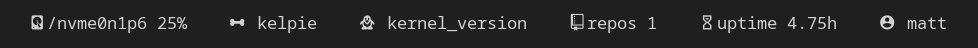

My collection of custom, though simple modules for [Polybar](https://github.com/polybar/polybar).
     
# Current Modules

|Module  |Description
|--------|------------
|[Disk](modules/disk)    |Displays the currently used storage of a disk partition.
|[Dogs](modules/dogs)    |Displays a random breed of dog using [Dog CEO](https://dog.ceo/dog-api/).
|[Kernel](modules/kernel)  |Displays the current kernel version you're running.
|[Repos](modules/repos)   |By using the [GitHub API](https://docs.github.com/en/rest), the module displays how many public repositories a chosen user has.
|[Uptime](modules/uptime)  |Displays the current uptime of your system.
|[User](modules/user)    |Displays the name of the currently logged-in user.

  
# Dependencies

All of the modules are made with **Bash**, however:

modules vary in their dependencies. Most of them make use of **usually pre-installed tools** on Linux distributions. A good way to check if you have all of the dependencies of a script is by running the script itself - it should let you know if a command/tool is not found.
    
# Installation and setup
- Let's start by installing your desired script. Go to the **modules** directory, and then find the directory of the module you'd like. Then, install the corresponding **.sh** file.
- After you've installed the script, move it to a location you'd like. I tend to put my custom modules into a directory inside of Polybar's .config *(e.g. `.config/polybar/scripts/`)*.
- Now it's time to make the file executable. You can do this with **chmod**: `chmod +x /path/to/the/script.sh`.
- **SUGGESTED:** Check if the module even works by running it - do `bash /path/to/the/script.sh`.
- Now, it's time to **configurate** the module. Use an editor of your choice and open the script file. All of the modules are documented with comments to help you configure more easily.
- After a proper configuration, you can now add the module to the polybar config. You can find a `README.md` in every **module's directory**. It has a template for how to initialize the module in the Polybar config.
- Now, all that's left to do is add the module to a bar! If you don't know how to do so, [this](https://github.com/polybar/polybar/wiki#where-to-start) is a great resource.
- And that's it! Congrats, you have one of my custom modules :)
    
# Creator's notes
Hey! Thanks for checking out my little project! It's very simple, but I hope it does spark some ideas for a custom module of your own :)

I made these modules because I:
- wanted them, but couldn't find a good one online,
- thought they'd be fun to make,
- wanted to practice some of the tools Linux has to offer.

Anyways, I'm glad you checked this out, Enjoy!
