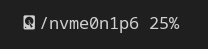

# Disk Module
After you've completed the setup as explained [here](../../README.md#installation-and-setup), you can add this module inside of the Polybar config:

```ini
[module/disk]
type=custom/script
exec = ~/path/to/the/script.sh
interval = 10
```
You can also customize this a bit:
- you can change the name (e.g. `[module/disk] -> [module/new-name]`),
- the `exec` path to the script's current location,
- and the `interval`.

After that, you can add the module to your bar. Please note that if you did change the name, you will have to use the new name when adding the module to your bar.

That's it! You should now see something along the lines of:



Note that the output will vary depending on your configuration!
